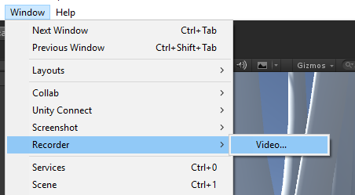
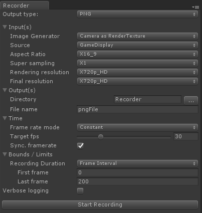
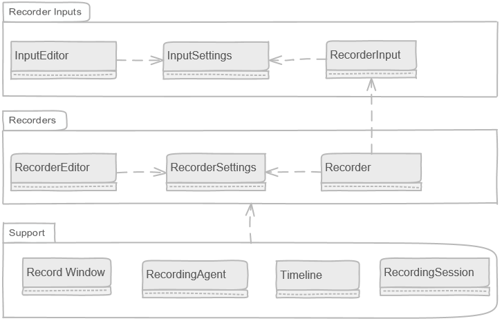
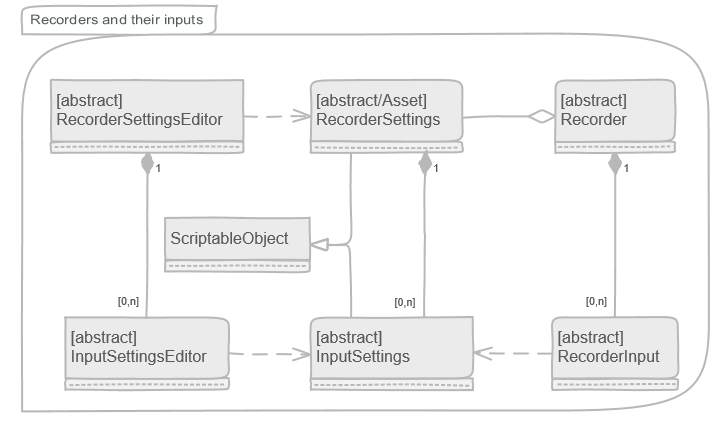
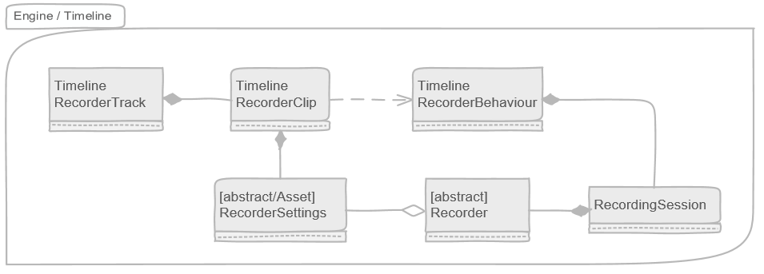

# Frame Recorder
### Brief
The *Frame Recorder* is a project that facilitates recording of Unity artifacts from Unity. The framework does not define what can be recorded, but defines a standard way of how to implement and setup a recorder and takes care of aspects common to all recorders (time managenent, Timeline integration, record windows, etc). 

Extensibility is a prim concideration and since not all use cases can be thought of in advance, whenever relevant, the framework's base classes strive to offer an easy way to override the default beahviour of the system. 

Recorder types are detected at run time and made available to the recording framework dynamically.

A key consideration is peoviding a uniform UX. By defining a standard pattern and basic classes, the framework can treat all recorders equally and display them consistently. This allows for a generic “recorder window” that is provided and takes care of configuring and starting a “recording session” from edit mode.

Code reusability and easy of use for developers is also a prime consideration. As much as possible, modularization in a Lego mentality is promoted so that work done for one specific recorder, say MP4 recording, can be reused by an other type of recorder, say PNG or WAV recorders.

### Current limitations
* Recorders are Player standalone friendly, but not the editors.
* Framerate is set at the Recorder level which makes for potential conflict when multiple recorders are active simultaneously.

## Triggering a Recording

### Through the Editor's Record window

1. Select a type of recording and open the recorder window

2. Edit the recorders settings

3. Click "Start Recording" to lauch recording.

Note that this can be done  from edit mode and from game mode...

### From a timeline track
1. Create a timeline asset and add it to the scene.
2. Add a "Frame Recorder track" to the timeline.
3. Add a "Frame Recorder clip" to the track.
4. Select the newly added slip

5. Edit the clip's settings

6. Enter play mode and trigger the timeline through behaviours...

## Design

### Conceptual blocks breakdown
The Recording framework is composed of three conceptual groups:

* **Recorders**: the part that takes data feeds (Inputs) and transform them into whatever format they want (Image input -> mp4 file). They do NOT deal with gathering the data from Unity: that is the Inputs task. Every recorder is broken down into three pieces: Recorder, Settings and Settings Editor.
* **Inputs**: specialized classes that know how to gather a given type of data from unity and how to pre-package that data in a way that is ready from consumption by the Recorders. Like recorders, Inputs are borken down into three parts: Input, Setttings and Settings Editor.
* **Support**: holds the FrameRecorder's logic, UI, timeline integration and services.

### Recorders and there Inputs
Here are the classes that make up recorders and their inputs.

#### Recorder:
* Base/abstract class of all “recorders”. A recorder being the class that consumes the artifacts coming from the Unity engine and is responsible for transforming/encoding and “storing” them into the final output of a recording event. Examples would be: MP4, WAV, Alembic, Animation clips.
* Instances of this class are temporary and live only for the duration of the actual recording. The data they record comes, normally, from RecorderInput objects (see below). 
* A recorder can have [0,n] inputs and is responsible for mixing/transcoding/processing the data coming from its inputs. In the context of audio recording, sources can be seen as audio tracks, where each track is a separate audio source.
* Recorders get notified of when to start recording, when a new frame is being prepared, when a frame is ready to be recorded (at which point the recorder can read the frame’s data from it’s inputs) and when the recording ends.
* Recorders are not responsible for handling/controlling time. That is the responsibility of the underlying recording service.
* Recorders are responsible for creating their inputs and do so based on the specialized RecorderSettings objects that is passed to it on instantiation.
* Recorder classes register themselves with the recorder framework by decorating themselves with the class attribute [FrameRecorder]. Notice that there are no dependencies from the inputs to the recorders and from the recorder's settings to the recorder.
#### RecorderSettings
* Each non-abstract recorder must provide a specialization of this class. This is where the recorders settings (output path, encoding settings, etc) are stored.
* Recorder settings are persited assets (ScritableObject).
* RecorderSettings do not hold the Input settings directly but refer to assets that are the Input settings.
* This base class comes with universal setting fields that apply to all recorders.
* Instances of this class are stored as sub-assets of other assets. The parent asset varies depending on the situation (recorder window vs timeline for example).
* The system does NOT enforce a recorder to use a RecorderInputs. It’s just the prefered way of doing things.
#### RecorderInput
* Base class for all data sources that recorders interact with directly to gather/access the Unity game time artifacts to record.
* The input classes have NO dependency on the recorders or their settings classes. This is important so that they can be reused between recorders. 
* Input classes have there own Settings class that is stored as persiste assets.
* A family of Inputs is defined by their input type and output type and that is what determines if a recorder can use a source or not. (If a recorder can only record a RenderTexture but a given source outputs a packed pixel buffer/array, the recorder can’t use it).
* Examples: RenderTextureInput, CameraInput, DisplayInput, GeometryInput, AudioInput.
* Inputs are responsible for gathering the data that the recorders end up recording. For example, say we have a recorder that wants to record  the Display:
  * The recorder needs to select an Input that listens on the display and outputs a RenderTexture.
  * The selected Input is responsible for figuring out how to do that.
* Inputs, just like the recorders, get notified of events like BeginRecording, new frame, etc.
#### RecorderSettingsEditor
#### RecorderInput
#### InputSettings
#### InputSettingsEditor

### The Recorder Editor classes

### Game mode classes

### Timeline integration

### Creating a new type of Recorder

### Creating a new Input

